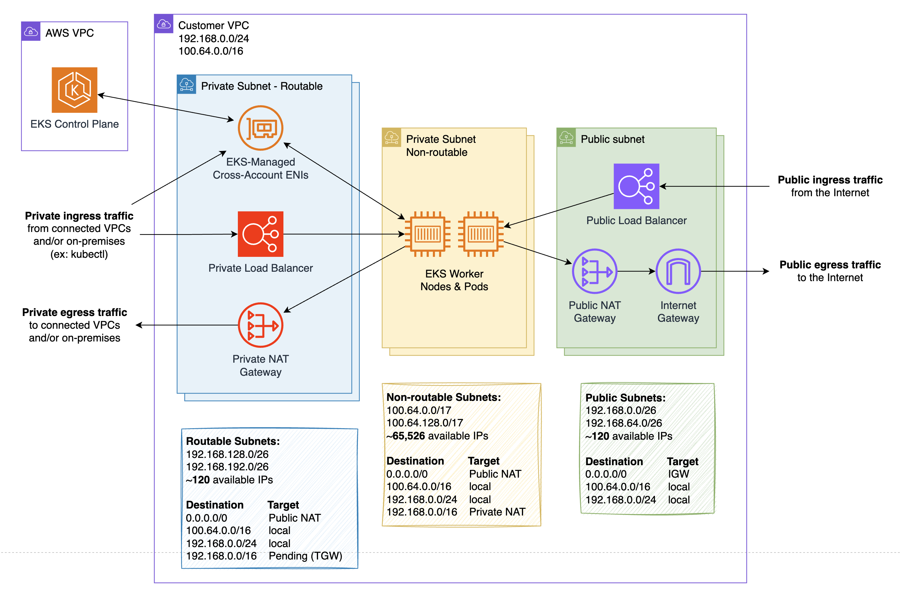

EKS Auto Mode using non-routable IP range
---

This pattern shows how to run an EKS Auto Mode cluster with worker nodes and pods running in a non-routable IP range.



Using a non-routable IP range for worker nodes and pods is useful to overcome IP exhaustion in environments where private IP addresses (RFC 1918) are scarce.

This pattern addresses uses NAT Gateway to route pod and node egress traffic:

- Private NAT Gateway - for egress traffic to connected VPCs and on-prem networks
- Public NAT Gateway - for egress traffic to the Internet

This pattern implements most aspects of the architecture explained in blog post [Addressing IPv4 address exhaustion in Amazon EKS clusters using private NAT gateways](https://aws.amazon.com/blogs/containers/addressing-ipv4-address-exhaustion-in-amazon-eks-clusters-using-private-nat-gateways/). THe main difference is that this pattern places EKS cluster endpoint ENIs in routable private subnets, to enable private access to the Kubernetes API from connected VPCs and on-prem networks.

**Important considerations:**

- EKS cluster endpoint ENIs are placed in routable private subnets, which allows private access to the Kubernetes API from connected VPCs and on-prem networks (ex: kubectl access).
- Pods and services can be exposed internally and externally using Load Balancers (ex: service NLB and ingress ALB).
- Clients running outside the cluster VPC (ex: security tools) can connect to the cluster Kubernetes API, but won't be able to directly connect to worker nodes IP. Consider using daemons running on the nodes (ex: DaemonSet) that report to external tools.

Additional Steps Required
---
To enable connectivity to on-prem networks and connected VPCs, create a TGW/VGW and create a route associated with VPC private subnets pointing to this TGW/VGW to route private traffic.

Deploy
---
Apply terraform files:

```bash
terraform apply
```

Clean up
---
First, remove the sample app and/or any other application that you deployed ot the cluster:

```bash
kubectl delete -n sample-app -f sample-app.yaml
```

Then, destroy the infrastructure created with terraform:

```bash
terraform destroy
```
